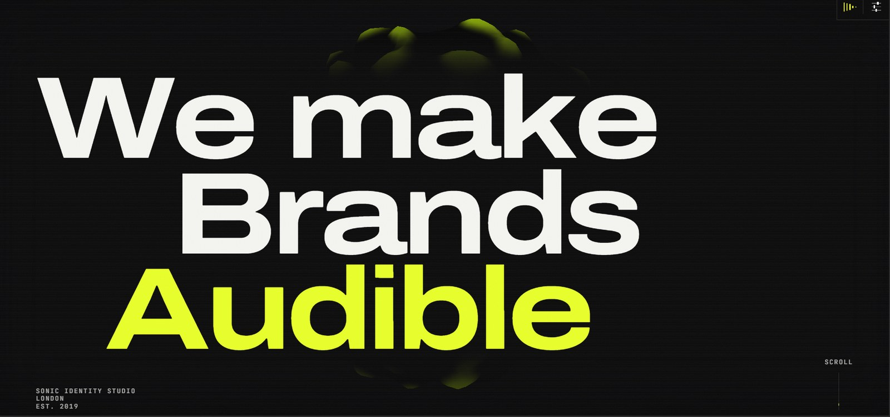
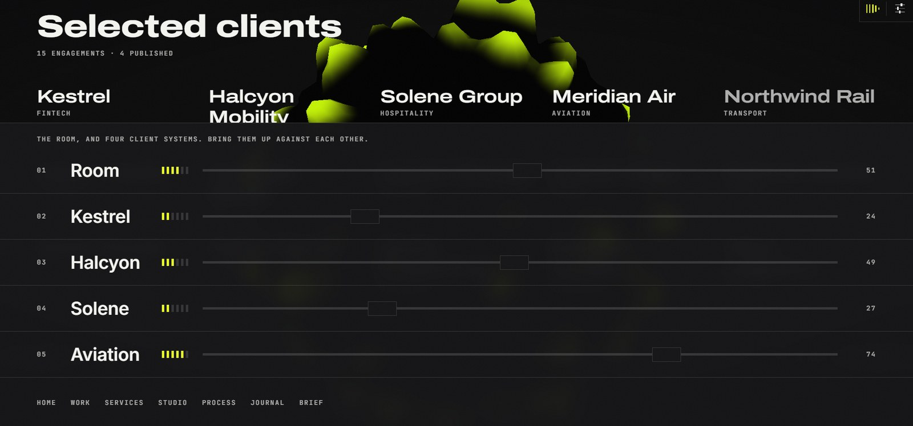
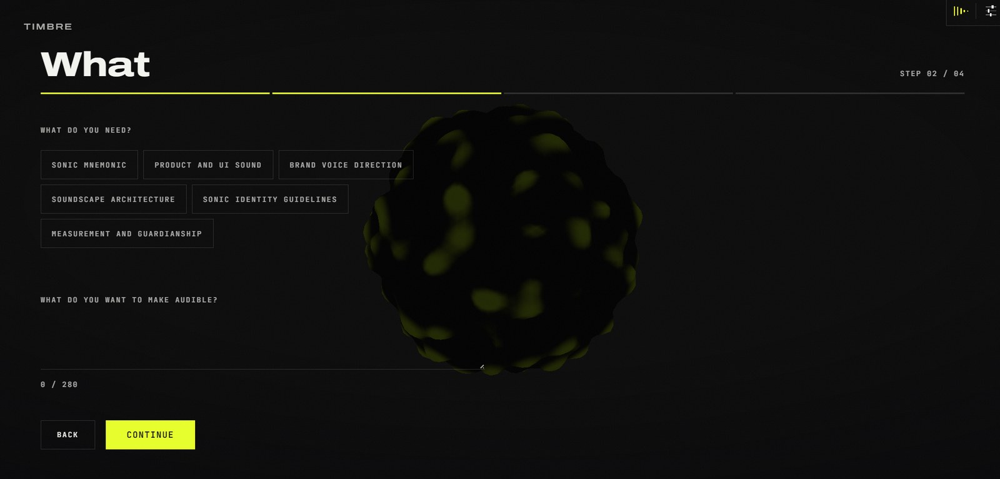
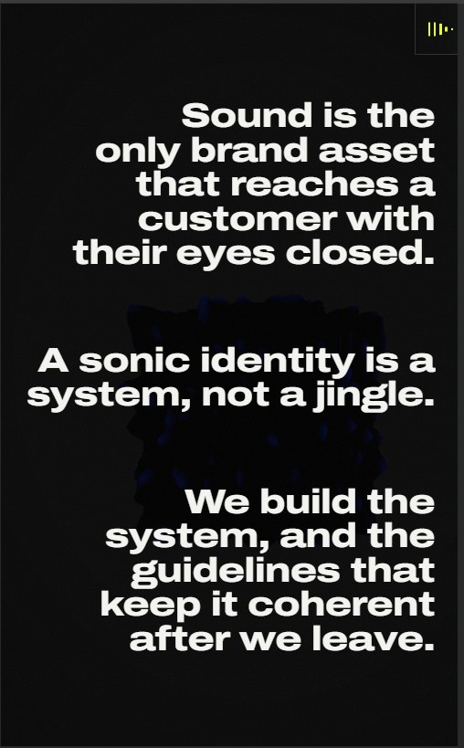
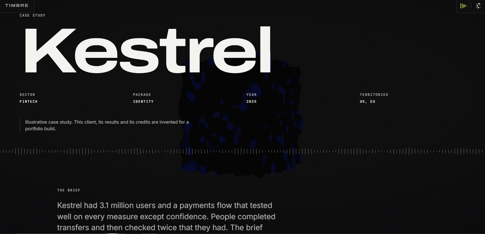

# TIMBRE

**A marketing site where the interface is driven by sound.** A single WebGL
sculpture deforms in real time against live Web Audio analysis, persists across
every route without the canvas ever remounting, and the navigation is a mixing
desk whose faders ride real gain nodes.

**Live:** <https://timbre-liard.vercel.app>

> **TIMBRE is a fictional studio.** It has no clients and has never delivered a
> project. The four case studies, their results, the names in the credits and
> the client wall are invented, and every sound on the site is synthesised by
> [scripts/generate-audio.mjs](scripts/generate-audio.mjs). The brand is made up
> so the engineering has something real to be measured against.

---



## What it does

- **Audio-reactive hero.** One `AudioContext`, one `AnalyserNode`
  (`fftSize: 2048`), three normalised frequency bands driving vertex
  displacement, emissive mix and palette in a GLSL shader.
- **One canvas, every route.** The canvas mounts once in the root layout and is
  driven from a Zustand store rather than route props, so navigating never
  rebuilds the WebGL context.
- **A mixing desk that mixes.** Five channels — the room and four client stems —
  with faders writing real gain values. Because the analyser sits *after* the
  master gain, the sculpture reshapes itself against whatever mix you build.

- **Per-destination route transitions.** One motion grammar, four dialects: case
  studies sweep in their own accent colour, Services in six blades for six
  service lines, Brief in four for four form steps, and going back always
  travels the opposite way to going forward.
- **Consent-gated audio with full sound-off parity.** Nothing plays before an
  explicit gesture. Decline, and the sculpture keeps moving from a baked FFT
  envelope committed as a 3 KB JSON.
- **Three render profiles** chosen by a capability probe before the canvas
  mounts, with automatic step-down when the rolling frame rate drops.
- **Reduced motion as a designed path**, not a stripped one: Lenis never
  constructs, scrubs become discrete states, the sculpture composes to a fixed
  pose, every route still renders its content.
- **A brief form** with per-step validation, draft persistence, rate limiting,
  honeypot, Cloudflare Turnstile verification and delivery via Resend.



*The desk, mid-mix. Every fader writes a real gain node, and the analyser sits
after the master gain — so the sculpture behind it is reacting to whatever you
just built.*

<p>
  
  
</p>

## Architecture

The decisions that shaped everything else.

**One RAF loop, and a written hierarchy.** Lenis, GSAP ScrollTrigger and
react-three-fiber each want to own `requestAnimationFrame`. Running all three
produced scroll jitter that no single component was responsible for. The fix was
a rule rather than a patch: **Lenis drives, the GSAP ticker is the only RAF
loop, R3F subscribes to it**, with `lagSmoothing(0)` so a dropped frame never
desynchronises scrub position from scroll position.

**The canvas is state, not markup.** Mounted once via `next/dynamic` with
`ssr: false`; active case, render profile and audibility live in a store. Route
transitions become a wipe over a continuously rendering scene.



**The audio graph is a singleton with a real mixer.** Master gain, analyser,
per-source gains, and a ducking helper that counts nesting depth so two
overlapping players cannot un-duck each other early. Voices are named
independently of buffers, so the work rail can audition a stem while the desk
holds the same file as a channel.

**Content is typed where structured, MDX where prose.** Case studies are a
filled-in template — sector, package, asset inventory with loudness and formats,
metrics, credits — so they are TypeScript, checked at build time. The journal is
genuinely prose, so it is MDX.

```
src/
  app/            routes, api/brief, sitemap, robots, opengraph-image
  components/
    webgl/        SceneMount -> SceneRoot -> SoundSculpture (shader)
    transport/    MixingDesk, SiteControls, RouteWipe
    brief/        BriefForm, TurnstileWidget
    chrome/       HomeMark, SiteFooter
  lib/
    audio/        AudioEngine, mixer, analyser bands, consent, baked envelope
    motion/       route dialects, sculpture motion, reveals
    webgl/        capability probe, profiles, shader tuning, identities
    brief/        schema, delivery adapters, rate limiters, storage
    security/     CSP builder
content/
  en/ui.json      all UI copy, externalised
  journal/        MDX posts
```

## Tech stack, and why

| Choice | Reasoning | Rejected |
|---|---|---|
| **Next.js 16 App Router** | Case-study copy must be in the initial HTML for SEO while the hero stays client-only. Server components give both without a second rendering strategy. | Vite SPA, which puts every indexable word behind hydration |
| **react-three-fiber** | The sculpture's state *is* React state. Reconciling it declaratively beats hand-syncing an imperative scene graph. | Raw three.js: more control, more manual mirroring |
| **GSAP + ScrollTrigger** | `containerAnimation` drives triggers *inside* a horizontally-pinned rail. Nothing CSS-only does this. | Framer Motion, excellent for components but with no equivalent scrub model |
| **Zustand** | The canvas lives outside the route tree, so context would mean lifting providers above the layout. | React context |
| **Zod, shared client and server** | One schema gates step advancement *and* validates the endpoint, so the two cannot drift. | Separate validators, which is how forms come to accept what servers reject |
| **`fetch` over the Resend, Upstash and Turnstile SDKs** | Each is one endpoint, a bearer token and a JSON body. Three fewer dependencies to audit. | The official SDKs |
| **Docker for everything** | CI runs the same image as development, so "works on my machine" cannot diverge from "works in CI". | Local Node with nvm |

## Running it

Everything runs in Docker. Node is not installed on the host and does not need
to be.

```bash
docker compose run --rm cli "npm install" && docker compose up web
```

Then <http://localhost:3000>. The install is only needed on a clean clone —
`node_modules` lives in a named volume, not on the bind mount.

| Task | Command |
|---|---|
| Dev server | `docker compose up web` |
| Full static gate | `docker compose run --rm cli "npm run verify"` |
| Unit tests | `docker compose run --rm cli "npm test"` |
| End-to-end | `docker compose --profile tools up -d web-prod`, then `docker compose run --rm e2e "npx playwright test"` |
| Stop everything | `docker compose --profile tools down` |

Copy [.env.example](.env.example) to `.env.local` if you want the integrations.
**Every one degrades to a working local stub when its key is absent**, so
development works with the file untouched: the form still validates, rate-limits
and returns a reference code, and logs what it would have emailed.

### Why the container is shaped the way it is

**`node_modules` lives in a named volume.** The source is bind-mounted from
Windows into WSL2, and every file operation on that mount crosses the VM
boundary. `.next` deliberately stays on the bind mount, because Turbopack splits
its state between `.next` and `.next-internal` and separating them breaks
recompilation.

**`npm run dev` passes `--webpack`.** inotify events do not survive the
Windows-to-Linux mount boundary. Turbopack's watcher never fired even with
polling configured; webpack's does. Builds still use Turbopack, unaffected
because they do not watch.

**`NODE_ENV` is not set in the image.** The Next CLI derives it per command, and
pinning it leaks into `next build`, where the prerender of `/_global-error`
fails with a null React dispatcher.

## Testing

```bash
docker compose run --rm cli "npm run verify"
```

Chains lint, typecheck, a guard that no text uses the sub-3:1 ink token, **326
unit tests**, the production build, and a bundle-size gate that fails the build
if initial JS exceeds its budget.

**194 end-to-end tests** run across Chromium, WebKit and a dedicated
reduced-motion project, including axe-core on every route at zero
serious/critical violations.

What is tested is what has actually broken here, or what is invisible when
wrong: the contrast ratios from the design spec, asserted against the shipped
palette; the shader tuning constants, which put the accent colour across 14.6%
of the viewport against a 4% cap before recalibration; the CSP in all eight of
its configurations; the audio band maths; and reduced-motion parity route by
route.

A screen-reader pass was run by hand with **NVDA on Windows**, because
Accessibility 100 and zero axe violations are machine checks and a machine
cannot tell you whether an interface makes sense to someone who cannot see it.

It found two real defects, and neither was visible to any automated tool.

Pressing Continue on an invalid step set the field errors, shook the form and
announced **nothing** — every error was rendered and correctly tied to its input
with `aria-describedby`, which is only spoken when that input takes focus, and
focus stayed on the button. Sighted visitors saw red text; a screen-reader user
got silence. Fixed by announcing the failure count in a live region and moving
focus to the first failing field, then re-tested by ear.

The second was heading navigation. Pressing `H` on a first visit answered **no
next heading** on a homepage that has six. The headings were all there and all
correctly named; the consent gate in front of them carried `aria-modal="true"`,
which confines a screen reader's virtual buffer to the dialog, and the dialog's
title was set as a `<p>`. So the buffer really did contain no headings — the
answer was correct and the markup was the lie. One element changed from `<p>` to
`<h2>`.

Both have the shape the section below is about: code that is correct, behaviour
that is wrong, and nothing between the two that a machine can see.

What passed unchanged: the skip link as first focusable element, and — the one I
expected to fail — route changes, which announce the new heading rather than
swapping content in silence.

WebGL inside a container is software-rendered, which the capability probe
correctly rejects — so containerised runs always exercise the fallback path and
never the real hero. Frame-rate targets have to be measured on the host.

## Measured, not estimated

Lighthouse, run through PageSpeed Insights against the live deployment — an
emulated Moto G Power on Slow 4G for mobile. Two runs, and both are quoted,
because a single run of a lab test is a sample rather than a number.

| | Mobile | Desktop |
|---|---|---|
| Performance | **95** | **99 – 100** |
| Accessibility | **100** | **100** |
| Best Practices | **100** | **100** |
| SEO | **100** | **100** |

| Metric | Mobile | Desktop | Target |
|---|---|---|---|
| Largest Contentful Paint | 2.9 s | 0.7 s | ≤ 2.5 s mobile — **missed** · ≤ 2.0 s desktop — met |
| First Contentful Paint | 1.0 s | 0.3 s | — |
| Cumulative Layout Shift | **0** | **0** | ≤ 0.05 |
| Total Blocking Time | **20 ms** | 90 ms | — |
| Speed Index | 2.3 s | 0.9 s | — |

**One target is missed and it is the interesting one** — though not for the
reason I first wrote down here, and the wrong reason is worth keeping.

The first diagnosis was that a persistent WebGL canvas is the shape that costs
LCP. It reads well and it was wrong. Acting on it did produce a real
improvement: the three.js chunk was being fetched immediately after hydration
and *behind the consent gate*, an opaque full-screen wall over a canvas nobody
can see until the gate is answered, and deferring it cut JavaScript downloaded
but unused on first paint from 225 KB to 50 KB. Mobile LCP after that change:
2.9 s. Exactly what it was before.

So I opened the LCP breakdown instead of theorising, and it names the element:

    main#main > section.shell > h1.relative > span.block

That is the words "We make" — the first line of the hero lockup. Time to first
byte 0 ms, **element render delay 800 ms**. Text, not canvas. The chunk was never
in the LCP path, which is why moving it changed nothing.

The element is also behind the gate. LCP does not account for one element being
covered by another, so the metric is timing a piece of text that no visitor sees
at the moment it is measured — the filmstrip is two blank frames and then the
gate, all the way down. That is not an argument that the number is wrong. It is
the reason the number is hard to move without changing something a visitor
would notice, and the reason this stays a documented miss rather than a target
chased until the metric relents.

Reading that filmstrip carefully turned up something worth more than the metric.
It is below, under the bugs.

CLS is a flat zero on both, which is the number that usually suffers on a site
with this much motion. Total Blocking Time is 20 ms, which is the number that
would have suffered if the LCP problem had really been the canvas.

Bundle and paint budgets, from the build's own gate:

| | Result | Budget |
|---|---|---|
| Initial client JS | 129.3 KB gz | 210 KB |
| three.js chunk, lazy-loaded | 234.6 KB gz | 340 KB |
| Fonts downloaded | 165.9 KB | 96 KB — **missed** |
| Signal-colour viewport coverage | 3.85% at peak | 4% |
| Sculpture GPU cost at 1280x720 | ~2.0 ms of a 16.67 ms frame | — |

The font budget assumed licensed static faces hand-subset to Latin; the free
stand-ins are variable fonts carrying their whole design space. Stated rather
than quietly dropped.

Real-device check: the site was exercised by hand on a phone — the sculpture
renders, scrolling holds up, and the desk's faders drag under touch.

Appending `?fps=1` to any URL prints a live reading in the corner: the rolling
mean, and the slowest single frame in the window. The mean is what the degrade
guard acts on; the worst frame is what a 30 fps floor is actually about, since a
mean of 58 containing one 90 ms frame is a stutter somebody felt. It is absent
unless the URL asks for it, so a normal visit pays nothing for it.

It also says why it cannot read, rather than showing a "measuring" that never
resolves — `fallback profile · no canvas`, `reduced motion · canvas idle`, `tab
hidden · loop stopped`, or `stalling` with the raw slowest frame. The last of
those exposes something the degrade guard cannot see: `FrameRateMonitor`
discards its window on any frame over 250 ms, so that a single long frame cannot
condemn a healthy machine — which means a machine slow enough to stall on every
frame never completes a window, and never trips the guard that exists for it.
The guard is right about the case it was written for. The readout covers the one
it was not.

## Four bugs worth reading about

Every one of these passed the entire automated suite.

**A `<span>` that killed every navigation.** GSAP's `SplitText` replaces a
heading's text node with per-character spans. React still held references to the
nodes it rendered, so unmounting the hero — every navigation away from home —
threw `NotFoundError: Failed to execute 'removeChild'` and took the whole tree
down with it. `useEffect` cleanup runs *after* React detaches a deleted subtree,
so the revert arrived too late; `useLayoutEffect` runs before it.

**A transform that broke a pin.** Animating `main` with `y` left a transform on
it, and a transformed ancestor becomes the containing block for every
`position: fixed` descendant — including ScrollTrigger's pin on the work rail,
which then measured itself against `main` instead of the viewport and lost the
whole section until it had scrolled past.

**A wipe that could not cover its own swap.** A prefetched route swaps in tens of
milliseconds while any cover worth watching takes hundreds, so the destination
painted before the blades arrived. Delaying navigation fixed the flash and fought
`next/link`, which navigates regardless of `preventDefault`. Covering *instantly*
and sweeping away afterwards has neither problem.

**An entrance animation nobody ever saw.** The hero lockup is split per character
and staggered in over about two seconds — the most worked-on motion on the site.
It ran from hydration, and the consent gate is `fixed inset-0` with an opaque
background at z-9000. So it played behind a wall. Answer the gate in under two
seconds and you caught the tail of it; take any longer and the hero was simply
already there, settled, as though it had never moved.

Nothing could catch this. It is not a rendering fault, an accessibility fault or
a timing fault — every element was correct, visible and in the right place, and
the animation ran exactly as written. It is two correct components with no
knowledge of each other, and the only way to see it is to watch the thing load
and notice an absence.

What found it was a PageSpeed filmstrip, while I was chasing an unrelated number
and looking at the frames for a different reason: two blank, then the gate, and
the hero in not one of them. The intro now waits for the gate to be answered.
Because that handover happens in a layout effect, the `from` state is applied in
the same commit that unmounts the gate, so the lockup never flashes settled
before dropping to its start position.

## Known gaps

Named rather than left for someone to find. Three remain, and the third
replaced one I had prematurely written up as closed.

1. **VoiceOver has not been run.** The hand pass covered NVDA on Windows. macOS
   and iOS are untested, and I do not have the hardware to test them honestly. A
   claim of "screen-reader accessible" resting on one screen reader is worth
   exactly what it says and no more.
2. **No custom domain.** The site is on a `vercel.app` subdomain, which also
   means Resend will only deliver briefs to my own address. A portfolio piece
   does not need one; it is listed because the deployment is otherwise complete.
3. **Mobile LCP is 2.9 s against a 2.5 s target.** Diagnosed rather than
   guessed at this time: the element is the first line of the hero lockup, with
   an 800 ms element render delay, and it sits behind the consent gate while it
   is measured. Deferring the three.js chunk was the first attempt and did not
   move it by a millisecond, which is written up under *Measured, not estimated*
   because a wrong diagnosis that survived a whole fix is worth more than a
   clean one. Every other metric passes, including a Total Blocking Time of
   20 ms and a Cumulative Layout Shift of zero.


## Specification

Self-authored, in [docs/](docs/) — [PRD](docs/01-PRD.md),
[UI/UX spec](docs/02-UIUX-Design-Spec.md) and
[roadmap](docs/03-Roadmap-and-Plan.md). Each carries a note on what in it is
invented and what is measured, and both carry revision notes recording where the
first draft was wrong: the contrast table, the shader constants, the geometry
density, a `ScrollTrigger.scrollerProxy` that was actively harmful, and the
fallback video that should never have been specified. Those notes are the useful
part — a specification nobody argued with was not being read.

Deployment runbook: [docs/DEPLOYMENT.md](docs/DEPLOYMENT.md).

## Licence

Apache 2.0 — see [LICENSE](LICENSE).
